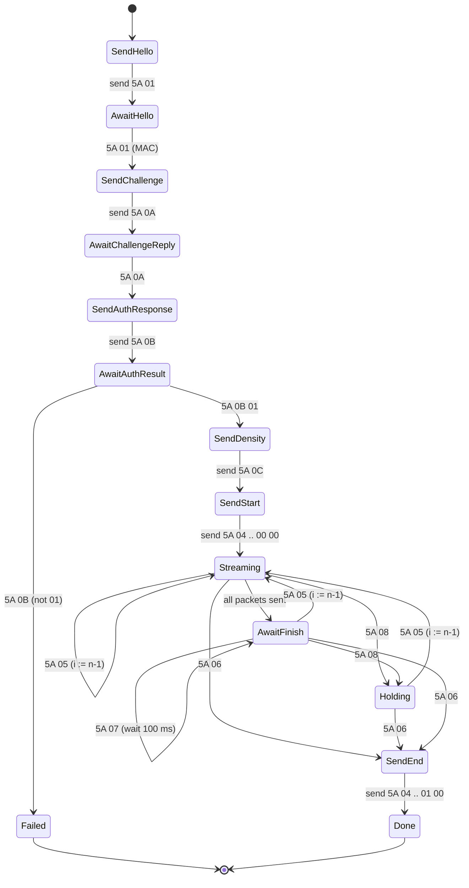

# BLE thermal printer protocols

A complete description of the wire protocols spoken by the printers this
project drives — the LX-D02 / LX-D2, and the X6 / X6h "cat printer" family —
written for someone implementing them from scratch in any language.

Sections 1–10 and the appendices cover the LX-D02 / LX-D2 protocol. **§11 covers
the X6 / X6h "cat printer" family**, a second, entirely unrelated protocol this
project also speaks. The two share nothing — not the framing, not the CRC, not
the GATT profile.

Everything here is reverse-engineered. Nothing is vendor documentation. Where the
code in this repository, the reference implementations, and observed behavior
disagree — or where a field's meaning is simply unknown — this document says so.

**Authority for this document.** Every byte value, offset, and behavior below was
checked against the implementation in this repository:

| Area | Source |
|---|---|
| CRC | `crates/printa-ble-core/src/protocol/crc.rs` |
| Auth | `crates/printa-ble-core/src/protocol/auth.rs` |
| Host → printer packets | `crates/printa-ble-core/src/protocol/packets.rs` |
| Printer → host frames | `crates/printa-ble-core/src/protocol/notifications.rs` |
| Session state machine | `crates/printa-ble-core/src/protocol/job.rs` |
| Bitmap packing | `crates/printa-ble-core/src/raster/bitmap.rs` |
| X6 CRC8 | `crates/printa-ble-core/src/protocol_x6/crc.rs` |
| X6 framing | `crates/printa-ble-core/src/protocol_x6/packets.rs` |
| X6 printer → host frames | `crates/printa-ble-core/src/protocol_x6/notifications.rs` |
| X6 session state machine | `crates/printa-ble-core/src/protocol_x6/job.rs` |
| Model facts (UUIDs, name prefixes) | `crates/printa-ble-core/src/model.rs` |
| BLE transport (native) | `crates/printa-ble/src/ble.rs` |
| BLE transport (browser) | `web/app.js` |

Claims about the three reference projects (rusq, ValdikSS, paradon) are **not**
verifiable from this repository — their source is not vendored here. Those claims
come from this project's own research notes (`docs/plans/2026-07-27-lxd2-design.md`
and the phase 1 plan) and are labelled as secondhand where they matter.

---

## 1. Scope and hardware

### Devices

| Property | Value | Confidence |
|---|---|---|
| Models | LX-D02, LX-D2 | Confirmed — this is what the project targets and tests against |
| Vendor | Shenzhen Xiqi Technology | Reported; not verified from firmware |
| Official app | "FunnyPrint" (iOS/Android) | Reported |
| Advertised BLE name | starts with `LX` | Confirmed — the only discovery signal this project uses |
| Print head width | 384 dots | Confirmed (`raster/bitmap.rs`: `WIDTH = 384`) |
| Resolution | 203 dpi (8 dots/mm) | Reported; consistent with 384 dots ≈ 48 mm |
| Paper | 58 mm stock, ~48 mm printable | Reported |
| Colors | 1 bit, black on thermal paper | Confirmed |

Other printers sold under the same app, or other `LX*` names, *probably* speak the
same protocol, but this is an assumption. The only hard discovery test in this
project is the advertised name prefix plus the presence of characteristics `0xFFE1`
and `0xFFE2`.

### These are not "cat printers"

The widely cloned "cat printer" family (GB01/GB02/GT01, MX05/MX06, and the
`cat-printer` software ecosystem) uses BLE service `0xAE30`/`0xAE01`-family
characteristics and a completely different framing (`0x51 0x78 …` commands with a
CRC8 table and run-length-compressed raster). **None of that applies to the
LX-D02.** The LX-D02 uses service `0xFFE6`, `5A`/`55` framing, an authentication
handshake, and uncompressed raster. Cat-printer software cannot drive an LX-D02,
and this protocol cannot drive a cat printer. Do not mix the two bodies of
documentation.

This project *does* also drive one member of that family — the X6 / X6h — but
through a completely separate protocol module (`protocol_x6/`), documented in
§11. Nothing in sections 2–10 applies to it.

---

## 2. BLE transport

### GATT profile

| Role | 16-bit UUID | Full 128-bit UUID | Properties used |
|---|---|---|---|
| Service | `0xFFE6` | `0000ffe6-0000-1000-8000-00805f9b34fb` | primary service |
| Write (host → printer) | `0xFFE1` | `0000ffe1-0000-1000-8000-00805f9b34fb` | **write without response** |
| Notify (printer → host) | `0xFFE2` | `0000ffe2-0000-1000-8000-00805f9b34fb` | notify (subscribe via CCCD) |

The 128-bit forms are the standard Bluetooth SIG base-UUID expansion
(`0000XXXX-0000-1000-8000-00805f9b34fb`).

Writes use **write without response** (`WriteType::WithoutResponse` in
`ble.rs`; `writeValueWithoutResponse()` in `web/app.js`, with a fallback to
`writeValue()` if the browser lacks it). Nothing in the protocol acknowledges a
write at the GATT layer; flow control happens entirely through `0xFFE2`
notifications.

### This is a generic serial-over-BLE module

`0xFFE0`/`0xFFE1` is the classic JDY-08 / HM-10 / CC254x "transparent UART" profile.
The LX-D02 uses the same style of module with the service shifted to `0xFFE6`. Two
consequences:

1. **There is no distinctive service UUID in the advertisement.** You cannot filter
   on the service to find these printers. Discovery is by advertised local name
   prefix `LX`, then confirm by discovering `0xFFE1` and `0xFFE2` after connecting.
   `web/app.js` requests `filters: [{ namePrefix: "LX" }], optionalServices: [0xffe6]`;
   `ble.rs` scans without a filter and matches `name.starts_with("LX")`.
2. **The module is a dumb pipe.** All structure — framing, indices, auth — is
   implemented by the printer's MCU behind the UART, not by GATT.

### MTU

A raster packet is 100 bytes, so a single ATT write needs an MTU of at least 103.
Neither `ble.rs` nor `web/app.js` requests an MTU explicitly — CoreBluetooth and
Chrome negotiate a large MTU automatically and the printer accepts the writes. On
stacks where you control the MTU (BlueZ raw sockets, some embedded stacks) you will
need to negotiate MTU ≥ 103 before streaming, or the raster packet will be
fragmented and — most likely — rejected. *This is an inference from packet size, not
an observed failure.*

### The macOS wrinkle: no MAC address from the OS

CoreBluetooth deliberately never exposes a peripheral's Bluetooth MAC address. It
gives you an opaque, host-specific `NSUUID`. The same is true of Web Bluetooth in
Chrome.

The authentication handshake (§6) is keyed on the printer's MAC. Therefore:

> **The MAC used for authentication must come from the printer's own `5A 01` hello
> reply (bytes 4..10), never from the transport layer.**

This is not merely a macOS convenience — it is the only portable source of the MAC,
and it is why the hello exchange is mandatory before auth. `job.rs` stores the MAC
from `Notification::Hello` and uses nothing else.

On macOS the first BLE access also triggers the TCC Bluetooth permission prompt for
the host application; a denied prompt surfaces as a scan failure, not as a missing
device.

---

## 3. Framing

Two packet families share the link. There is **no length field, no sequence number,
and no checksum on the wire** in either family. The only CRC anywhere in the
protocol is inside the auth payload (§6).

### Control packets — `5A`

```
5A <cmd> [payload …]
```

Variable length, 2 to 12 bytes in practice. Both directions use this family. The
command byte disambiguates; the receiver is expected to know each command's length.

### Raster packets — `55`

```
55 <index:u16 big-endian> <96 bytes of bitmap> 00
```

Exactly **100 bytes**, always. Host → printer only.

| Offset | Size | Field |
|---|---|---|
| 0 | 1 | `0x55` magic |
| 1..3 | 2 | packet index, **big-endian**, starting at 0 |
| 3..99 | 96 | two print lines of 48 bytes each (§8) |
| 99 | 1 | `0x00` |

The trailing `0x00` is constant. It is emitted by `packets::raster()` and asserted
in that module's tests. Its purpose is unknown — it is *not* a checksum (a checksum
would vary with the payload) and it is *not* a length. Treat it as required
padding/terminator and always send `0x00`.

Note the deliberate asymmetry: control packets start with `0x5A`, raster packets
with `0x55`. A receiver distinguishes them on the first byte alone.

---

## 4. Host → printer command reference

All of these are written to `0xFFE1` without response. Byte values below are exact;
they are produced by `protocol/packets.rs` and pinned by that module's unit tests.

| Command | Opcode | Length | Bytes | When sent |
|---|---|---|---|---|
| Hello | `5A 01` | 12 | `5A 01 00 00 00 00 00 00 00 00 00 00` | First packet after subscribing to `0xFFE2` |
| Auth challenge | `5A 0A` | 12 | `5A 0A` + 10 challenge bytes | After the hello reply arrives |
| Auth response | `5A 0B` | 12 | `5A 0B` + 10 response bytes | After the `5A 0A` reply arrives |
| Set density | `5A 0C` | 3 | `5A 0C <level>` | After auth succeeds, before print start |
| Print start | `5A 04` | 6 | `5A 04 <count:u16be> 00 00` | Immediately after density |
| Raster | `55` | 100 | `55 <index:u16be> <96B> 00` | Streamed after print start |
| Print end | `5A 04` | 6 | `5A 04 <count:u16be> 01 00` | After the `5A 06` finished notification |

### Hello — `5A 01`

```
5A 01 00 00 00 00 00 00 00 00 00 00
```

Twelve bytes: the opcode followed by ten zero bytes. Whether the printer requires
the full 12 bytes or would accept a bare `5A 01` is **unverified** — this project
always sends 12, matching the length of the other handshake packets. Send 12.

The printer answers with a `5A 01` frame carrying its MAC (§5).

**Hello is idempotent, and this project sends it twice per connection.** The
transport sends one as a liveness probe immediately after subscribing (see
"Proof of life" below), and the print FSM opens with its own — as does every
copy in a multi-copy run, all over the same connection. The printer answers each
one with a fresh `5A 01`. Nothing in the protocol treats a second hello as an
error or resets any state that matters; an implementation may greet as often as
it finds useful.

#### Proof of life

On macOS, CoreBluetooth caches the GATT database of any peripheral it has paired
with before. Connecting to a **switched-off** printer therefore succeeds, as does
service and characteristic discovery, and even subscribing to `0xFFE2` — all
answered from the cache. Nothing in that sequence proves the hardware is there.

The `5A 01` reply is the first thing in the flow that only the printer itself can
produce, so this project reports a connection only once the reply arrives (4 s
budget). A device that connects and stays silent gets its own error —
`found <name> but it did not respond — is the printer powered on?` — separate
from "no device found", because the two faults need different actions from
whoever is standing next to the printer.

Any implementation on a platform that caches GATT (macOS, and Web Bluetooth in
Chrome) needs this check or an equivalent, or it will report success against
hardware that is off.

### Auth challenge — `5A 0A`

```
5A 0A <c0> <c1> <c2> <c3> <c4> <c5> <c6> <c7> <c8> <c9>
```

Ten bytes of host-chosen randomness. See §6 — the *host* issues the challenge and
then answers it itself; the printer only judges the answer.

### Auth response — `5A 0B`

```
5A 0B <r0> <r1> <r2> <r3> <r4> <r5> <r6> <r7> <r8> <r9>
```

Ten bytes derived from the challenge and the printer's MAC (§6).

### Set density — `5A 0C`

```
5A 0C <level>
```

Three bytes. `level` is the print darkness. **Valid range 1–7.**

Note where that range is enforced: not in the packet builder or the state machine,
which accept any `u8`, but in the user-facing layers (`clap` value parser in
`cli.rs`, `validate()` in `server.rs`, and `WasmJob::new` in
`printa-ble-web/src/job.rs`, all `1..=7`). The project default is **3**. What the
firmware does with 0 or with values above 7 is **untested** — this project never
sends them.

The printer sends no acknowledgement for this command. The current density is
echoed back in later status frames at byte 7 (§5), which is the only feedback
available.

### Print start / print end — `5A 04`

Start and end share one opcode and differ only in byte 4:

```
print start:  5A 04 <count_hi> <count_lo> 00 00
print end:    5A 04 <count_hi> <count_lo> 01 00
```

`count` is the **number of raster packets** in the job — not the number of print
lines, and not a byte count. It is big-endian `u16`. Both packets carry the same
count.

Worked example, from `packets.rs` tests: a job of `0x0142` = 322 raster packets
(644 print lines) gives

```
start:  5A 04 01 42 00 00
end:    5A 04 01 42 01 00
```

Byte 5 is always `0x00`; its meaning is unknown.

Print end is sent **after** the printer reports `5A 06` finished — it closes the
job, it does not trigger printing.

---

## 5. Printer → host notification reference

All frames arrive as notifications on `0xFFE2`. Every frame begins with `0x5A`;
there is no `55` traffic in this direction. Parsing rules below are exactly those in
`protocol/notifications.rs`, including its minimum-length guards.

A frame shorter than 2 bytes, or not starting with `0x5A`, is not a valid
notification. Unrecognized opcodes should be ignored, not treated as errors — the
firmware may emit frames this project has never seen.

| Opcode | Min length | Meaning |
|---|---|---|
| `5A 01` | 10 | Hello reply, carries MAC |
| `5A 02` | 5 | Status (unsolicited, periodic) |
| `5A 05` | 4 | Lost packet — resend from index − 1 |
| `5A 06` | 4 | Print finished |
| `5A 07` | 2 | Cooldown — back off |
| `5A 08` | 2 | Hold — pause streaming |
| `5A 0A` | 2 | Challenge reply (payload is garbage) |
| `5A 0B` | 3 | Auth result |

### `5A 01` — hello reply

Minimum 10 bytes. The frames this project has captured and pinned in its tests are
12 bytes.

| Offset | Size | Field |
|---|---|---|
| 0 | 1 | `0x5A` |
| 1 | 1 | `0x01` |
| 2..4 | 2 | unknown — ignored by this implementation |
| **4..10** | **6** | **printer MAC address, in order** |
| 10..12 | 2 | unknown (present in observed frames), ignored |

Example (from the parser's unit test):

```
5A 01 00 00 AA BB CC 11 22 33 00 00
            └─────── MAC ──────┘      →  AA:BB:CC:11:22:33
```

The MAC bytes are used **in the order received**, unreversed, as the auth key.
Getting the byte order wrong is the most likely cause of an auth failure. Note that
BLE stacks commonly display MACs in reverse of their over-the-air order — this field
is the printer's own payload and needs no reordering.

### `5A 02` — status

Unsolicited. The printer starts emitting these on its own once you subscribe to
`0xFFE2`; **there is no "request status" command in this protocol.** To read status,
connect, subscribe, and wait. This project waits up to 3–5 seconds for the first
frame and treats a timeout as "unknown", not as an error.

| Offset | Size | Field | Interpretation |
|---|---|---|---|
| 0..2 | 2 | `5A 02` | — |
| 2 | 1 | battery | percentage, 0–100 |
| 3 | 1 | paper | `!= 0` → **out of paper** (note the inverted sense) |
| 4 | 1 | charge state | `1` → charging, `2` → fully charged, other → neither |
| 5 | 1 | overheat | `!= 0` → print head overheating (**optional**) |
| 6 | 1 | low battery | `!= 0` → low battery warning (**optional**) |
| 7 | 1 | density | current darkness setting (**optional**) |
| 8..10 | 2 | voltage | millivolts, **big-endian** (**optional**) |

"Optional" means literally that the frame may be shorter. The parser requires ≥ 5
bytes (through the charge-state byte) and then reads bytes 5, 6, 7, and 8..10 only if
present, yielding `false` / `None`. A 5-byte frame is valid and reports only battery,
paper, and charge state.

Which frame lengths real firmware actually emits is **not established** — the short-
frame handling is defensive. Implement the same tolerance.

Full-length example:

```
5A 02 50 01 01 00 00 03 0F A0
      │  │  │  │  │  │  └──┴─ 0x0FA0 = 4000 mV
      │  │  │  │  │  └─────── density 3
      │  │  │  │  └────────── low battery: no
      │  │  │  └───────────── overheat: no
      │  │  └──────────────── charging
      │  └─────────────────── OUT OF PAPER
      └────────────────────── battery 80%
```

Short example: `5A 02 37 00 02` → battery 55%, paper OK, fully charged, everything
else unknown.

### `5A 05` — lost packet

```
5A 05 <index_hi> <index_lo>
```

Minimum 4 bytes. `index` is a big-endian raster packet index. The printer is telling
you it is missing data at that index. See §7 for the resend rule — which is *not* "resend
that index".

This frame doubles as the resume signal after a `5A 08` hold.

### `5A 06` — print finished

```
5A 06 <count_hi> <count_lo>
```

Minimum 4 bytes. `count` mirrors the packet count. The printer has consumed the job;
respond with print end (`5A 04 … 01 00`).

The printer decides when a job is over. This implementation accepts `5A 06` even
while it still believes packets remain unsent, and moves straight to print end.

### `5A 07` — cooldown

```
5A 07
```

No payload required (parsed at length ≥ 2; any trailing bytes are ignored). The
print head is too hot; slow down. This implementation pauses **100 ms**
(`COOLDOWN_MS` in `job.rs`) and then resumes streaming at the packet it was about to
send. Cooldown is a throttle, not an error, and does not rewind the index.

Whether 100 ms is the right back-off, or whether the printer expects a longer pause
or repeats the frame until satisfied, is **unverified**. The safe implementation
handles repeated `5A 07` frames by simply backing off again.

### `5A 08` — hold

```
5A 08
```

No payload. Stop sending raster packets. Do not send anything until a `5A 05` (which
resumes, with a resend index) or a `5A 06` (which ends the job) arrives. Sending into
a hold is presumably what causes the buffer overrun the hold is meant to prevent.

### `5A 0A` — challenge reply

Sent in response to the host's `5A 0A` challenge. **The payload is meaningless.**
This project's notes record it as uninitialized RAM (secondhand, attributed to
ValdikSS's analysis), and the parser discards it entirely — `Notification::AuthChallengeReply`
carries no data.

> **Never validate the `5A 0A` reply payload.** Treat its arrival as nothing more than
> "the printer is ready for the response". Any implementation that checks these bytes
> will work on one unit and fail on the next.

### `5A 0B` — auth result

```
5A 0B <result>
```

Minimum 3 bytes.

| `result` | Meaning |
|---|---|
| `0x01` | authenticated |
| anything else | rejected |

The parser treats only `0x01` as success. Rejection is fatal: no further command in
the session will be honored, and this implementation aborts the job with
`JobError::AuthFailed`.

---

## 6. The authentication handshake

This is the part that keeps naive implementations from working, and the part where
the reference projects differ most.

### Shape of the exchange

The roles are inverted from a normal challenge/response. **The host issues the
challenge, and the host also computes the answer.** The printer merely verifies. The
shared secret is the printer's own MAC address, which the printer just told you.

```
host                                        printer
 │  5A 01 00×10                                  │
 │ ─────────────────────────────────────────────>│
 │                       5A 01 .. .. <MAC×6> ..  │
 │ <─────────────────────────────────────────────│   MAC learned here
 │  5A 0A <10 random bytes>                      │
 │ ─────────────────────────────────────────────>│
 │                       5A 0A <10 junk bytes>   │
 │ <─────────────────────────────────────────────│   payload ignored
 │  5A 0B <10 CRC high bytes>                    │
 │ ─────────────────────────────────────────────>│
 │                       5A 0B 01                │
 │ <─────────────────────────────────────────────│   authenticated
```

### The algorithm

For each challenge byte `challenge[i]`, `i` in 0..10, independently:

1. Build a 7-byte buffer: `[challenge[i], mac[0], mac[1], mac[2], mac[3], mac[4], mac[5]]`.
2. Compute CRC16-XMODEM over those 7 bytes.
3. `response[i]` = the **high byte** of that CRC (`crc >> 8`).

The 10 resulting bytes are the `5A 0B` payload. In Rust (`protocol/auth.rs`,
verbatim):

```rust
pub fn auth_response(challenge: &[u8; 10], mac: &[u8; 6]) -> [u8; 10] {
    let mut out = [0u8; 10];
    for (i, &c) in challenge.iter().enumerate() {
        let mut buf = [0u8; 7];
        buf[0] = c;
        buf[1..].copy_from_slice(mac);
        out[i] = (crc16_xmodem(&buf) >> 8) as u8;
    }
    out
}
```

Two details that are easy to get wrong: the challenge byte comes **first**, before
the MAC; and only the **high** byte of each CRC is transmitted — the low byte is
discarded.

### CRC16-XMODEM parameters

| Parameter | Value |
|---|---|
| Width | 16 bits |
| Polynomial | `0x1021` |
| Initial value | `0x0000` |
| Input reflected | no |
| Output reflected | no |
| XOR out | `0x0000` |
| Check (`"123456789"`) | `0x31C3` |

This is the standard CRC-16/XMODEM (a.k.a. CRC-16/ACORN, CRC-16/LTE, CRC-16/V-41-MSB).
Verify your implementation against the check value before debugging anything else.
Reference implementation (`protocol/crc.rs`, verbatim):

```rust
pub fn crc16_xmodem(data: &[u8]) -> u16 {
    let mut crc: u16 = 0;
    for &b in data {
        crc ^= (b as u16) << 8;
        for _ in 0..8 {
            crc = if crc & 0x8000 != 0 { (crc << 1) ^ 0x1021 } else { crc << 1 };
        }
    }
    crc
}
```

### Worked example

Computed with the exact code above (the two functions compiled verbatim and run;
the `"123456789"` check value came out `0x31C3` in the same run, confirming the CRC).

```
MAC       = 11 22 33 44 55 66
challenge = 5E 2A 00 FF 91 0C 7D 42 B3 08
```

| i | 7-byte CRC input | CRC16-XMODEM | high byte → `response[i]` |
|---|---|---|---|
| 0 | `5E 11 22 33 44 55 66` | `0x407E` | `0x40` |
| 1 | `2A 11 22 33 44 55 66` | `0x05D9` | `0x05` |
| 2 | `00 11 22 33 44 55 66` | `0x9861` | `0x98` |
| 3 | `FF 11 22 33 44 55 66` | `0x3D10` | `0x3D` |
| 4 | `91 11 22 33 44 55 66` | `0xBC82` | `0xBC` |
| 5 | `0C 11 22 33 44 55 66` | `0xCA0A` | `0xCA` |
| 6 | `7D 11 22 33 44 55 66` | `0xF60A` | `0xF6` |
| 7 | `42 11 22 33 44 55 66` | `0x256E` | `0x25` |
| 8 | `B3 11 22 33 44 55 66` | `0xB297` | `0xB2` |
| 9 | `08 11 22 33 44 55 66` | `0x0BCC` | `0x0B` |

Resulting packets on the wire:

```
host → printer:  5A 0A 5E 2A 00 FF 91 0C 7D 42 B3 08
host → printer:  5A 0B 40 05 98 3D BC CA F6 25 B2 0B
printer → host:  5A 0B 01
```

Use this vector as a unit test. If your `5A 0B` payload for that MAC and challenge is
not `40 05 98 3D BC CA F6 25 B2 0B`, one of: byte order in the CRC input, the choice
of high vs. low byte, or the CRC parameters is wrong.

### The weakness

Each response byte depends on exactly one challenge byte. There is no chaining, no
nonce coupling, no state carried between the ten computations. The "challenge" is
therefore ten independent one-byte challenges, all keyed on the same MAC.

The practical consequence — credited in this project's notes to ValdikSS's analysis
of the same handshake — is that an implementation can send an all-zero challenge and
then repeat a single CRC ten times:

```
host → printer:  5A 0A 00 00 00 00 00 00 00 00 00 00
host → printer:  5A 0B 98 98 98 98 98 98 98 98 98 98      (MAC 11:22:33:44:55:66)
```

Here `0x98` is the high byte of `crc16_xmodem([00 11 22 33 44 55 66]) = 0x9861` —
row `i = 2` of the table above, reused ten times. The printer accepts it. This is
verified as an algorithmic property in `auth.rs`'s own unit test
(`auth_response_matches_manual_crc` asserts all ten bytes are identical for an
all-zero challenge); it has not been separately confirmed against hardware in this
repository.

So the handshake provides no meaningful authentication — it only proves the host saw
the hello reply. It is an app-lock, not a security boundary. Treat any MAC you learn
from a hello reply as sufficient to drive the printer.

**This project implements the proper version anyway**: 10 bytes of fresh randomness
per job (`rand::random()` in `print_service.rs`, `crypto.getRandomValues` in
`web/app.js`), a full ten-CRC computation, and a new challenge for every copy in a
multi-copy run. There is no reason not to — the cost is ten CRCs over seven bytes.

### On rusq's hardcoded response

This project's research notes state that rusq/thermoprint hardcodes a captured
auth response, which therefore only authenticates against the single unit it was
captured from, and warn implementers away from copying it. That claim is
**secondhand** — rusq's source is not vendored in this repository and was not
re-checked while writing this document. The underlying point stands on its own
merits regardless: because the response is a function of the printer's MAC, any
constant response is unit-specific by construction.

---

## 7. Print session flow

### Sequence

```
host                                                   printer
  │                                                        │
  │  ── connect, discover 0xFFE6, subscribe 0xFFE2 ──       │
  │                                                        │
  │                        5A 02 <status>   (unsolicited)  │
  │ <──────────────────────────────────────────────────────│
  │  5A 01 00×10                                           │
  │ ──────────────────────────────────────────────────────>│
  │                        5A 01 .. .. <MAC> ..            │
  │ <──────────────────────────────────────────────────────│
  │  5A 0A <challenge×10>                                  │
  │ ──────────────────────────────────────────────────────>│
  │                        5A 0A <junk×10>                 │
  │ <──────────────────────────────────────────────────────│
  │  5A 0B <response×10>                                   │
  │ ──────────────────────────────────────────────────────>│
  │                        5A 0B 01                        │
  │ <──────────────────────────────────────────────────────│
  │  5A 0C <density>                                       │
  │ ──────────────────────────────────────────────────────>│
  │  5A 04 <count> 00 00                                   │
  │ ──────────────────────────────────────────────────────>│
  │  55 0000 <96B> 00                                      │
  │ ──────────────────────────────────────────────────────>│   ┐
  │      … 15 ms …                                         │   │ repeat for
  │  55 0001 <96B> 00                                      │   │ every packet,
  │ ──────────────────────────────────────────────────────>│   │ interleaved
  │                        5A 05 / 5A 07 / 5A 08 as needed │   │ with flow
  │ <──────────────────────────────────────────────────────│   ┘ control
  │                        5A 06 <count>                   │
  │ <──────────────────────────────────────────────────────│
  │  5A 04 <count> 01 00                                   │
  │ ──────────────────────────────────────────────────────>│
  │                                                        │
  │  ── unsubscribe, disconnect ──                          │
```

### State machine

This is `PrintJob` in `protocol/job.rs`, which is sans-IO: it emits actions
(`Send(bytes)`, `WaitMs(n)`, `WaitNotification`, `Done`) and consumes parsed
notifications. Reimplementing it in another language is mostly a transcription job.



Notifications that do not fit the current state are **ignored**, not treated as
errors. In particular, `5A 02` status frames arrive throughout and never affect the
state machine — paper and battery policy lives in the transport layer
(`check_paper` in `ble.rs` aborts the job if a status frame reports no paper).

### Flow-control rules, precisely

**Lost packet (`5A 05 <n>`) rewinds to `n − 1`, not to `n`.**

```
send_idx = max(n - 1, 0)      // saturating subtract; n = 0 rewinds to 0
```

Then resume streaming forward from there through the end of the job. Any pending
inter-packet wait is cancelled.

This off-by-one is deliberate and load-bearing. This project's notes attribute the
convention to observed behavior of the official app, transcribed from rusq's
`fsm.go`; `job.rs` carries the comment "the convention observed in the official app
(per rusq fsm.go)" and two unit tests pin it. **The underlying reason is not known.**
The plausible reading is that the printer reports the index it is *waiting for* while
having also discarded the one before it, or that the index is off by one relative to
what the host counts. Either way:

- Resending one packet too many is harmless — the raster packet carries its own
  index, so the printer can place or discard it idempotently. *(Inference: the
  protocol's use of explicit indices only makes sense if repeats are idempotent. Not
  directly verified.)*
- Resending one too few strands the printer waiting forever.

So if you deviate, deviate toward rewinding further, never less.

**Hold (`5A 08`) pauses.** Enter a state where you send nothing at all. Leave it only
on `5A 05` (which supplies the resume index and puts you back in streaming) or
`5A 06` (which ends the job). There is no timer-based exit from hold in this
implementation — a printer that goes silent after `5A 08` will trip the 10-second
notification timeout in `ble.rs`.

**Cooldown (`5A 07`) throttles.** Wait `COOLDOWN_MS` = **100 ms**, then continue from
the same index. It does not change the index and does not enter hold.

**Finished (`5A 06`) always wins.** Accepted in streaming, holding, or awaiting-finish
states. Send print end and stop, even if you believe packets are outstanding.

### Inter-packet delay: the implementations disagree

| Implementation | Delay between raster writes |
|---|---|
| **printa-ble (this project)** | **15 ms** (`INTER_PACKET_DELAY_MS` in `print_service.rs` and `printa-ble-web/src/job.rs`) |
| rusq/thermoprint | 7 ms (secondhand, from this project's notes) |
| ValdikSS/printer-driver-funnyprint | 20 ms (secondhand, from this project's notes) |

15 ms was chosen as a midpoint between the two references rather than derived from
measurement. This is a genuine open question: nobody has published a principled
value, and the right number likely depends on the host BLE stack's connection
interval as much as on the printer. Too fast produces `5A 08` holds and `5A 05`
resend requests; if your flow-control handling is correct, an aggressive delay
degrades throughput rather than breaking the print. Start at 15 ms, implement flow
control properly, and tune from there.

The delay is applied *between* raster packets only — not after the last one, and not
between control packets.

### Multiple copies

`print_service.rs` runs each copy as a **complete fresh job over the same
connection**: hello, new random challenge, auth, density, start, stream, finish,
end. The printer accepts a repeated handshake without disconnecting. Whether a
shortcut exists (re-issuing only `5A 04 … 00 00` for a second copy) is **untested**.

---

## 8. Image format

Nothing is compressed. Nothing is packed cleverly. The wire carries the framebuffer.

| Property | Value |
|---|---|
| Width | 384 pixels, fixed |
| Bits per pixel | 1 |
| Bit order within a byte | **MSB first** — bit 7 is the leftmost pixel |
| Bit sense | **1 = black** (burn), 0 = white (no burn) |
| Bytes per print line | 48 (`384 / 8`) |
| Print lines per raster packet | 2 |
| Bitmap bytes per raster packet | 96 |
| Compression | none |

Pixel `(x, y)` lives in row byte `x / 8`, at mask `0x80 >> (x % 8)`
(`raster/bitmap.rs`). So pixel x = 0 is bit `0x80` of byte 0, and pixel x = 383 is bit
`0x01` of byte 47.

### Packing two lines per packet

The bitmap is chunked in pairs of rows. For chunk `k`:

```
payload[0..48]   = row 2k
payload[48..96]  = row 2k + 1
```

and the packet is `55 <k:u16be> <payload> 00`, with `k` starting at 0.

**Odd heights zero-pad.** If the bitmap has an odd number of rows, the final chunk
contains the last row in bytes 0..48 and 48 zero bytes (blank) in bytes 48..96. A
3-row bitmap therefore produces 2 raster packets, and one blank line is printed at
the end. There is no way to print an odd number of lines exactly; the packet
granularity is two lines.

Packet count for a bitmap of `h` rows is `ceil(h / 2)`, and that is the value carried
by print start and print end.

### There is no feed command

Nothing in the command set advances paper. **Feeding is printing blank lines** — rows
of 48 zero bytes, packed and streamed like any other raster data
(`Bitmap::extend_blank`). This project appends 40 blank lines by default after every
job (`--feed`, default 40) so the printed content clears the tear bar.

Two consequences worth internalizing: a feed costs wire time and packet indices like
any other content, and a "feed only" operation is a normal print job whose bitmap is
entirely zeros.

---

## 9. Limits and quirks

| Limit | Value | Where enforced |
|---|---|---|
| Max raster packets | **65 535** (`u16::MAX`) | `PrintJob::new` returns `JobError::TooLarge` beyond it |
| Max print lines per job | **131 070** (65 535 × 2) | consequence of the above |
| Density range | **1–7** | CLI/server/WASM layers, *not* the protocol layer |
| Copies (this project) | 1–20 | CLI and server validation; not a protocol limit |
| Rendered image height cap | 4096 rows (~0.5 m of paper) | `raster/dither.rs`, a rendering-pipeline choice, not a protocol limit |

**The 65 535-packet ceiling is a real protocol limit**, not an arbitrary one: both the
raster packet index and the print start/end count are 16-bit. At 203 dpi, 131 070
lines is roughly 16 metres of paper, so it is unlikely to bind in practice — but a job
that exceeds it must be split into separate print sessions, and an implementation
must check rather than let the index wrap.

**Paper-out mid-print.** The protocol has no dedicated paper-out event. The printer
keeps emitting `5A 02` status frames throughout a job, and the paper flag (byte 3)
turns non-zero when paper runs out. This project polls those frames on the streaming
fast path and aborts the job as soon as one reports no paper
(`check_paper` in `ble.rs`). What the *printer* does — whether it holds the job,
discards it, or resumes on paper insert — is **unknown**. Do a pre-print status check
too: this project refuses to start when the first status frame reports no paper.

**Overheat.** Reported both as a status bit (byte 5) and as the `5A 07` cooldown
frame. The two are independent signals and this project treats them independently:
the status bit warns the user, the `5A 07` frame throttles the stream.

**No error frames.** There is no generic NAK, error code, or "bad command" response.
A malformed or unsupported command produces silence. Debug by observing which
notification *fails* to arrive.

**No checksums.** Apart from the auth CRC, nothing on the wire is protected. Integrity
rests entirely on BLE's own link-layer CRC plus the printer's index-based
retransmission requests.

**Timeouts.** None of this project's deadlines come from the protocol; all are
pragmatic. The native transport (`ble.rs`) uses:

| Constant | Value | Bounds |
|---|---|---|
| `CONNECT_TIMEOUT` | 15 s | Link establishment — CoreBluetooth's own connect never gives up |
| `HELLO_TIMEOUT` | 4 s | The `5A 01` liveness reply (§4) |
| `NOTIFICATION_TIMEOUT` | 10 s | Any frame at all, mid-job |
| `STALL_TIMEOUT` | 60 s | Forward progress, mid-job |
| `DISCONNECT_TIMEOUT` | 3 s | Best-effort teardown |

The browser page uses a single 10-second watchdog (`WATCHDOG_MS` in `web/app.js`),
the equivalent of `NOTIFICATION_TIMEOUT`.

The last two native deadlines are worth reimplementing together, because one does
not cover the other. **A notification deadline alone is not enough.** The printer
emits unsolicited `5A 02` status frames throughout a job, so a printer that holds
the stream (`5A 08`) and never resumes keeps re-arming a notification timer
indefinitely — the link looks healthy, frames keep arriving, and the job never
finishes. `STALL_TIMEOUT` measures the one thing the printer cannot fake: whether
raster packets are actually being consumed. A minute is deliberately generous,
since a genuine thermal cooldown resumes in seconds.

**Disconnection.** Nothing resumes a job across a disconnect. Reconnecting means
starting over from hello.

---

## 10. Reference implementations

Four prior projects. Each solved part of this, and none published a complete spec —
which is why this document exists.

| Project | Language | Contribution |
|---|---|---|
| [rusq/thermoprint](https://github.com/rusq/thermoprint) | Go | The first public reverse-engineering of the framing and the print-job **state machine** (`fsm.go`) — including the lost-packet "rewind to index − 1" convention this document inherits. Also shipped AirPrint integration. Its auth is a **hardcoded captured response**, valid only for the author's unit (secondhand claim; see §6). |
| [ValdikSS/printer-driver-funnyprint](https://github.com/ValdikSS/printer-driver-funnyprint) | Python / CUPS | The **best prior protocol documentation** — packet layouts, the status frame fields, the observation that the `5A 0A` reply payload is uninitialized garbage, and the **analysis of the auth weakness** (per-byte independence, so an all-zero challenge with one repeated CRC authenticates). A working CUPS raster driver. |
| [paradon/lxprint](https://github.com/paradon/lxprint) | TypeScript / Web Bluetooth | The **correct, general auth implementation**: real random challenge, per-byte CRC16-XMODEM over `[challenge[i]] + MAC`, high byte transmitted. This is the version reimplemented here. Demonstrated that the protocol works from a browser with no native driver. |
| [joaquimorg/lxprint](https://github.com/joaquimorg/lxprint) | Vue | A fork of paradon's work with a fuller UI. |

**printa-ble** (this repository) contributes the consolidation: a sans-IO state
machine with the full flow-control set (hold, cooldown, lost-packet rewind, printer-
initiated finish) unit-tested without hardware, proper random-challenge auth, and
this document.

None of the four vendored sources is present in this repository, so the attributions
above rest on this project's research notes rather than on a fresh reading of that
code. Credit is given as recorded; if you need the exact behavior of any of them,
read their source.

---

## 11. X6 / X6h family

A second, unrelated protocol: the X6 / X6h belongs to the "cat printer" family
that §1 warns against confusing with the LX-D02. This project drives it through
its own sans-IO module, `crates/printa-ble-core/src/protocol_x6/`, and nothing
in sections 2–10 applies here — different GATT profile, different framing,
different CRC, no authentication.

> **Not hardware-validated.** Unlike everything above, the X6 implementation
> has **not yet been confirmed against a physical printer**. Every byte value
> below matches this repository's code and the reverse-engineering sources, but
> no print has been observed coming out of real hardware. Treat the whole
> section accordingly until this notice is removed.

### Sources

| Source | Contribution |
|---|---|
| [parzivail's BLE thermal printer notes](https://parzivail.github.io/ble-thermal-printer/) | Frame format, command table, the raw-scanline command, the flow-control notification, and the captured frames the CRC tests pin |
| [nazarovmi/tinyprint-x6h](https://github.com/nazarovmi/tinyprint-x6h) | A working Python implementation: the CRC8 table, the `X6h-`/`x6h-` name prefixes, the blank lead row |
| [NaitLee/kitty-printer](https://github.com/NaitLee/kitty-printer) | Web Bluetooth precedent for the same family |

None of these sources is vendored here; claims attributed to them are
secondhand, exactly as §10 treats the LX references. The captured frames quoted
below are pinned in `protocol_x6/`'s unit tests.

### Devices and discovery

| Property | Value | Confidence |
|---|---|---|
| Models | X6, X6h | This is what the sources describe and this project targets |
| Advertised BLE name | starts with `X6h-` or `x6h-` | From tinyprint-x6h; this project matches exactly these two prefixes |
| Print head width | 384 dots | Same rendering pipeline as the LX-D02 |
| Colors | 1 bit, black on thermal paper | This implementation; the hardware also has a 4bpp grayscale mode (below) |

**`X6H-` (capital H) is deliberately not matched.** parzivail notes it is a
distinct model, so `model.rs` folds case only on the prefix's first letter:
`X6h-` and `x6h-` are claimed, `X6H-` is not.

### GATT profile

| Role | 16-bit UUID | Properties used |
|---|---|---|
| Service | `0xAE30` | primary service |
| Write (host → printer) | `0xAE01` | **write without response** |
| Notify (printer → host) | `0xAE02` | notify (subscribe via CCCD) |

The 128-bit forms are the standard SIG base-UUID expansion, as in §2. A
scanline frame is 56 bytes, so a single ATT write needs an MTU of at least 59 —
an inference from packet size, as with the LX-D02's 103.

### Framing

Every frame, in both directions, has the same layout:

```
51 78 <cmd> <dir> <len:u16 little-endian> <payload…> <crc8(payload)> FF
```

| Offset | Size | Field |
|---|---|---|
| 0..2 | 2 | `0x51 0x78` magic |
| 2 | 1 | command byte |
| 3 | 1 | direction: `0x00` host → printer, `0x01` printer → host |
| 4..6 | 2 | payload length, **little-endian** (the LX-D02's integers are big-endian; this family's are not) |
| 6..6+len | len | payload |
| 6+len | 1 | CRC8 over the **payload only** — not the header |
| 7+len | 1 | `0xFF` trailer |

Worked example, from parzivail (pinned in `packets.rs`' tests): command `0xA4`
with payload `[0x35]` frames as `51 78 A4 00 01 00 35 8B FF`. (This project
never sends `0xA4`; the frame is quoted only as a layout check.)

### CRC8

| Parameter | Value |
|---|---|
| Width | 8 bits |
| Polynomial | `0x07` |
| Initial value | `0x00` |
| Input/output reflected | no |
| XOR out | none |
| Scope | payload bytes only |

Check vectors, all lifted from captured frames rather than computed:
`crc8([0x35]) = 0x8B`, `crc8([0x10]) = 0x70`, `crc8([0x00]) = 0x00`,
`crc8([0x40, 0x01]) = 0x5C`, `crc8([]) = 0x00`.

### The command subset this project uses

The family has many more commands (quality, energy, device info, an
LZO-compressed scanline…). This project sends exactly two and parses exactly
one, and this document deliberately describes only those — the rest are
unverified here and belong to the sources.

| Command | Direction | Payload | Meaning |
|---|---|---|---|
| `0xA2` | host → printer | 48 bytes | One uncompressed 1bpp scanline |
| `0xA1` | host → printer | u16 LE | Feed that many pixel rows of blank paper |
| `0xAE` | printer → host | 1 byte | Device status: `0x10` = buffer full, `0x00` = ready |

#### `0xA2` — raw scanline, and the bit order

One frame per print line: 48 bytes of pixels, 384 dots, no packet index, no
compression, no per-frame acknowledgement.

**The bit order is the inverse of the LX-D02's.** This project's `Bitmap` is
MSB-first (bit `0x80` of byte 0 is pixel x = 0, as in §8); the X6 wants the
**leftmost pixel in the least-significant bit**. Every payload byte is
therefore bit-reversed on the way out (`u8::reverse_bits` in `packets.rs`): a
row whose first byte is `0x80` goes on the wire as `0x01`. Bit sense is
unchanged — 1 = black. Getting this wrong produces horizontally mirrored
8-pixel groups, which reads as noise.

#### The blank lead row

The first `0xA2` frame of every job is 48 zero bytes, prepended by
`X6PrintJob::new` before the bitmap's own rows. Per parzivail the printer
prints artifacts if the first row carries ink (tinyprint-x6h prepends a blank
line too). The lead row is real paper — one extra blank line per job — and is
counted in `packets_sent` but **not** in any user-facing line count.

#### `0xA1` — feed is a command here

The exact opposite of §8's "there is no feed command": on the X6 the trailing
feed is *not* blank raster lines but a single `0xA1` frame whose u16 LE payload
is a pixel count. Consequences: the feed costs one frame instead of wire time
proportional to its length, a feed of 0 sends nothing at all, and one feed
command tops out at 65 535 px (this project's print path saturates a larger
request to that maximum rather than failing the job — see `feed_px` in
`print_service.rs`).

#### `0xAE` — device status, the only flow control

Frames arrive on `0xAE02`. The parser accepts only direction `0x01`, command
`0xAE`, length 1, and two payload values (both captured verbatim by parzivail):

```
51 78 AE 01 01 00 10 70 FF      buffer full → stop sending scanlines
51 78 AE 01 01 00 00 00 FF      ready       → sending may resume
```

Everything else — battery frames, device info, the variants some models prefix
with `0x12`, unknown payload values — parses to nothing and is ignored, not
treated as an error: the family has many undocumented variants. (The received
CRC byte is not verified; the frame shape and payload value are the filter.)
A `Ready` with no pause open is ignored; a repeated `BufferFull` does not
restart the pause.

There is **no paper signal, no battery report, no completion notification, and
no resend mechanism** in the subset this project understands. `printable
status` and the server's `/status` fail against an X6 for exactly this reason.

### Print session flow

No hello, no auth, no start/end bracketing. The whole session is:

```
connect, discover 0xAE30, subscribe 0xAE02
0xA2 blank lead row
0xA2 per bitmap row          … 15 ms apart (INTER_PACKET_DELAY_MS, same
                               value the LX-D02 path uses); pause on
                               buffer-full, resume on ready
0xA1 feed                    … skipped when the feed is 0
wait 500 ms                  … then disconnect
```

The 500 ms settle (`SETTLE_MS` in `protocol_x6/job.rs`) exists because the
printer sends no completion event: without it the transport would tear the
link down while the printer is still draining its buffer. **The value is a
guess, to be tuned against hardware.** The inter-packet delay applies between
scanlines only — not before the feed command.

The transport reuses the LX-D02 path's deadlines — `NOTIFICATION_TIMEOUT`,
`STALL_TIMEOUT`, and the connect/disconnect deadlines of §9's table;
`HELLO_TIMEOUT` alone has no X6 role, there being no hello — and the same
`JobStats` counters: `holds` counts buffer-full pauses; `retransmits` and
`cooldowns` are always 0 — the protocol has no such events.

### No liveness probe — a weaker "connected"

The LX-D02's hello reply is what lets this project claim a connection means a
live printer (§4, "Proof of life"). **The X6 protocol has no known equivalent**,
and this implementation deliberately does not invent one from the undocumented
commands. `initialize` returns as soon as the notify subscription is up, so
"connected" means only that.

The §2 macOS caveat therefore bites in full: CoreBluetooth (and Web Bluetooth
in Chrome) answers connects and service discovery for a previously-seen
peripheral from its cached GATT database, so **a switched-off X6 can appear to
connect successfully**. The failure then surfaces as a print job that stalls in
silence — ended by the notification timeout — rather than as a connect error.

### The 4bpp mode is future work, and the sources disagree

The hardware also has a 16-level grayscale mode (4 bits per pixel). It is
**not implemented here**, in part because the two sources contradict each other
on the nibble order: parzivail documents the **lower** nibble as the leftmost
column, while tinyprint-x6h packs the **first pixel into the upper nibble**
(`(p0 >> 4) << 4 | (p1 >> 4)` in its packer). The discrepancy is unresolved —
do not implement 4bpp from either source without hardware confirmation.

### Quick byte reference

```
HOST → PRINTER (0xAE01, write without response)

  51 78 A2 00 30 00 <48 bytes> <crc8> FF     scanline, LSB = leftmost pixel
  51 78 A1 00 02 00 <px lo> <px hi> <crc8> FF   feed <px> rows (u16 LE)

PRINTER → HOST (0xAE02, notify)

  51 78 AE 01 01 00 10 70 FF                 buffer full → pause
  51 78 AE 01 01 00 00 00 FF                 ready → resume
```

---

## Appendix A: quick byte reference (LX-D02)

```
HOST → PRINTER (0xFFE1, write without response)

  5A 01 00 00 00 00 00 00 00 00 00 00        hello
  5A 0A c0 c1 c2 c3 c4 c5 c6 c7 c8 c9        auth challenge (10 random)
  5A 0B r0 r1 r2 r3 r4 r5 r6 r7 r8 r9        auth response  (10 CRC high bytes)
  5A 0C dd                                   density, dd = 1..7
  5A 04 nn nn 00 00                          print start, nn nn = packet count (BE)
  55 ii ii <96 bytes> 00                     raster, ii ii = index from 0 (BE)
  5A 04 nn nn 01 00                          print end

PRINTER → HOST (0xFFE2, notify)

  5A 01 ?? ?? m0 m1 m2 m3 m4 m5 ?? ??        hello reply, MAC at bytes 4..10
  5A 02 bb pp cc [oo] [ll] [dd] [vv vv]      status (see §5; bracketed = optional)
  5A 05 ii ii                                lost packet → resend from (ii ii) - 1
  5A 06 nn nn                                finished → send print end
  5A 07                                      cooldown → wait ~100 ms
  5A 08                                      hold → stop until 5A 05 or 5A 06
  5A 0A <10 junk bytes>                      challenge reply, payload meaningless
  5A 0B 01                                   auth OK (anything else = rejected)
```

## Appendix B: minimal implementation checklist (LX-D02)

1. CRC16-XMODEM passing the `"123456789"` → `0x31C3` check.
2. Auth vector from §6 reproducing `40 05 98 3D BC CA F6 25 B2 0B`.
3. Scan for a peripheral whose local name starts with `LX`; connect; discover
   `0xFFE6`; resolve `0xFFE1` and `0xFFE2`; subscribe to `0xFFE2`.
4. Notification parser with the length guards of §5, ignoring unknown opcodes.
5. Hello → capture MAC from bytes 4..10 → challenge → response → expect `5A 0B 01`.
6. 1-bit 384-wide bitmap, MSB first, 1 = black; pack pairs of rows into 96-byte
   payloads, zero-padding an odd final row.
7. Density, print start with `ceil(rows / 2)`, stream `55` packets with a ~15 ms gap.
8. Flow control: `5A 05` → rewind to index − 1; `5A 08` → pause; `5A 07` → 100 ms
   back-off; `5A 06` → send print end and finish.
9. Append blank rows for feed — there is no feed command.
10. Abort if a `5A 02` frame reports no paper.
11. Bound the wait for a notification *and* the wait for forward progress — the
    first alone cannot catch a printer that holds the stream and keeps sending
    status frames (§9).
12. On a platform that caches the GATT database (macOS, Chrome), treat the hello
    reply as the proof a printer is switched on; connect and discovery succeed
    without it (§4).
